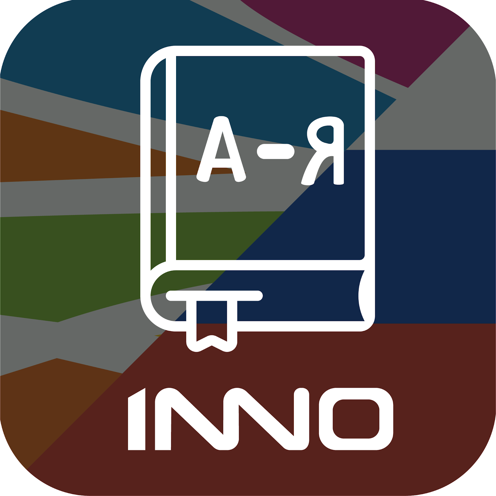
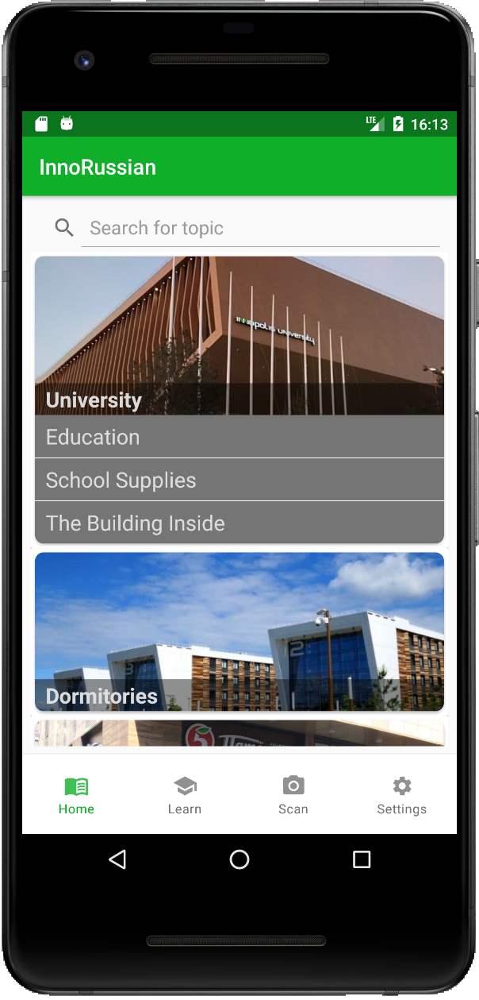
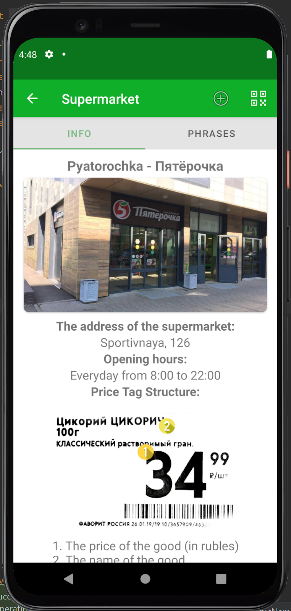
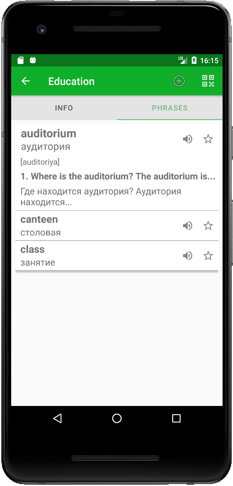
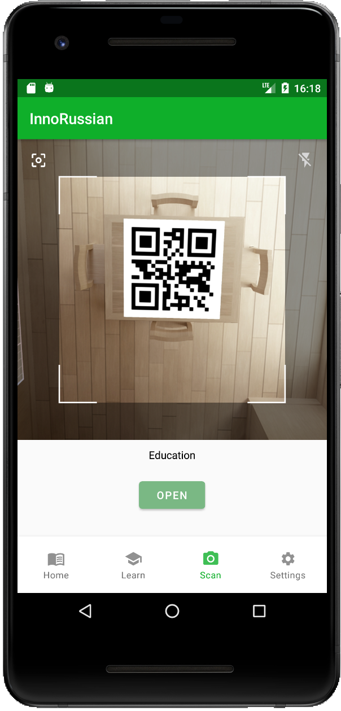
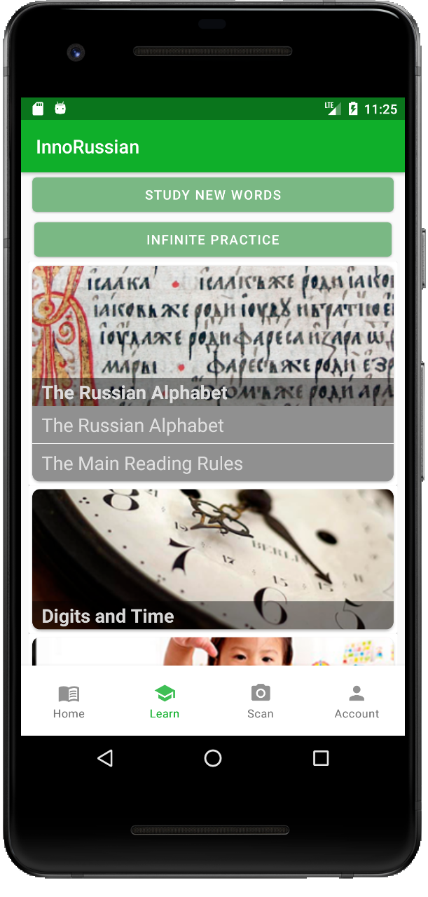
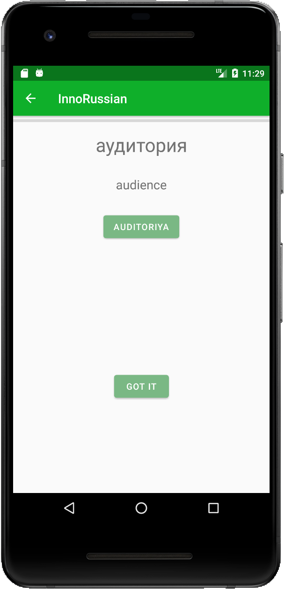
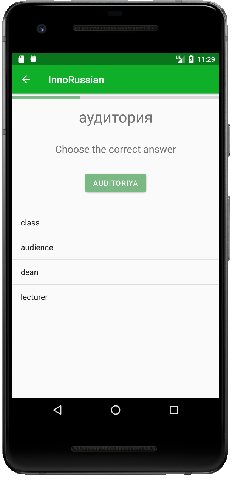
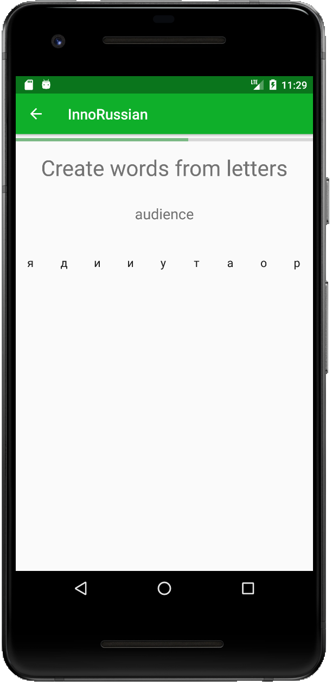
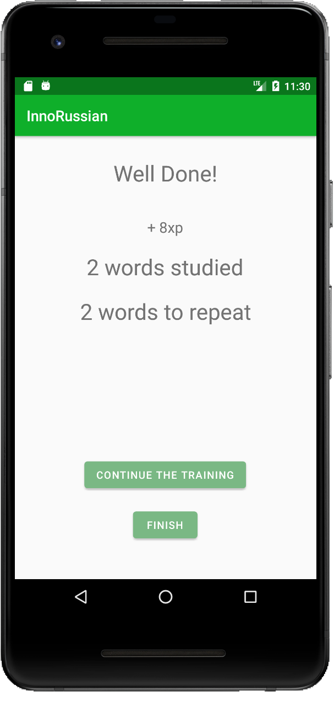

# FSE Project. InnoRussian team.

[F20] Fundamentals of Software Engineering project. BS19-02

* The project was developed during the FSE course in Innopolis University.
* This is the Android application written in Kotlin.

Stakeholder stated that the main purpose of this app is the following:
*“The goal is to somehow on board the newcomers who do not know Russian to get going in a few days and be able to live here in Innopolis”*

So, this app is focused on:
* Convenient way of getting information related to the particular place.
* Getting relevant phrases related to the particular place.
* Learning Russian language.

## Phrasebook

### Fast access to the phrasebook via scanning QR code

## Learning

### Quiz

